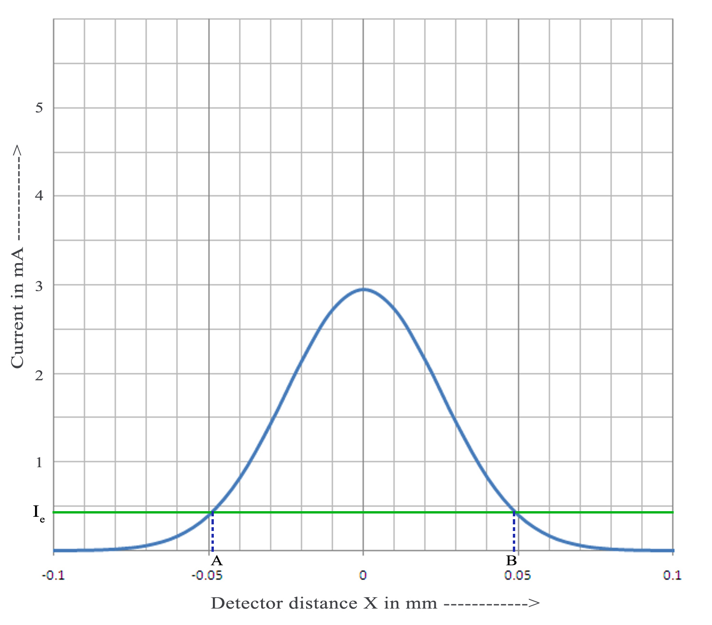
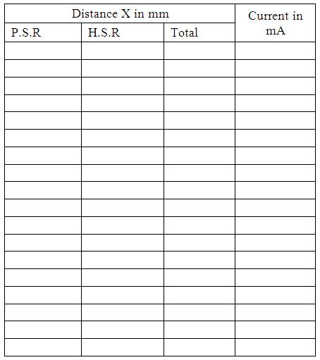

## Procedure

### Performing the real lab

- Arrange the laser and detector in an optical bench arrangement.
- The laser is switched on and is made to incident on the photodiode.
- Fix the distance, z between the detector and the laser source.
- By adjusting the micrometer of the detector, move the spot in the horizontal direction, from left to right.
- Note the output current for each distance, x from the measuring device.
- Then the beam profile is plotted with the micrometer distance along the X-axis and intensity of current along Y-axis. We will get a gaussian curve (see Fig.1).

Figure 1: beam profile of Laser beam divergence.

 

- The experiment is repeated for different detector distances.
- Note the points in the graph where the intensity equals $1/e^{2}$ of the maximum intensity, say it as $I_{e}$ (see Fig.1).
- Find the micrometer distance across the beam corresponding to these points ( B-A from the Fig.1) for a pair of detector distances $z_{1}$ and $z_{2}$. Half of this distance is noted as $w_{1}$ and $w_{2}$.
- Then the divergence and spot size of the laser beam can be calculated from the equations.

### Observation and calculation
To find the Least Count of Screw gauge 
One pitchscale division ( n) = .............. mm  
Number of divisions on head scale (m) = ...............  
Least Count (L.C) = n/m = ......................  
$z_{1}$ = ....................... cm    $z_{2}$ = ................ cm  

   <table style="width: 700px; margin: 0 auto; text-align: center;">
    <tr>
      <td></td>
      <td></td>
    </tr>
<tr>
  <td>
  1/e2 of maximum intensity,Ie =................ mA 
Diameter of the beam corresponds to Ie, d1= ..................mm
  </td>
     <td> 1/e2 of maximum intensity,Ie =................ mA 
Diameter of the beam corresponds to Ie,  d2= ..................mm
  </td>
  </tr>
    
  </table>

