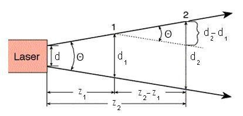
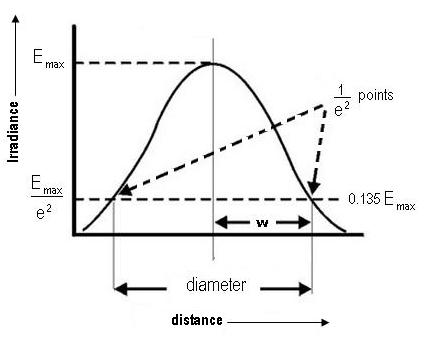

### Theory

<iframe width="560" height="315" src="https://www.youtube.com/embed/Xaq4YUd6e2E" frameborder="0" allow="autoplay; encrypted-media" allowfullscreen></iframe>

### Laser

The term LASER is the acronym for Light Amplification by Stimulated Emission of Radiation. It is a mechanism for emitting electromagnetic radiation via the process of stimulated emission. The laser was the first device capable of amplifying light waves themselves. The emitted laser light is a spatially coherent, narrow low-divergence beam. When the waves(or photons) of a beam of light have the same frequency, phase and direction, it is said to be coherent . There are lasers that emit a broad spectrum of light, or emit different wavelengths of light simultaneously. According to the encyclopedia of laser physics and technology, beam divergence of a laser beam is a measure for how fast the beam expands far from the beam waist. A  laser beam with a narrow beam divergence is greatly used to make laser pointer devices. Generally, the beam divergence of laser beam is measured using beam profiler.
 

Lasers usually emit beams with a Gaussian profile. A Gaussian beam is a beam of electromagnetic radiation whose transverse electric field and intensity (irradiance) distributions are described by Gaussian functions.
 

For a Gaussian beam, the  amplitude of the complex electric field is given by

$$E(r,z)=E_{0}\frac{w_{0}}{w_{z}}exp(-ikz-ik\frac{r^{2}}{2R_{z}}+i\zeta(z))$$

  where,

$r$       - radial distance from the centre axis of the beam  
$z$       - axial distance from the beam's narrowest point  
$i$        - imaginary unit (for which $i^{2} =-1$) 
$k$       - wave number (in radians per meter). 
$w_{z}$    - radius at which the field amplitude drops to 1/e and field intensity to 1/e2 of their axial values, respectively.  
$w_{0}$   - waist size. 
$E_{0}$     =  |E( 0,0) |  
$R_{z}$     - radius of curvature of the beam's wavefronts  
$\zeta(z)$   - Gouy phase shift. It is an extra contribution to the phase that is seen in  beams which obey Gaussian profiles. 

The corresponding time-averaged intensity (or irradiance) distribution is

$$I(r,z)=\frac{\left| E(r,z) \right|^{2}}{2\eta}=I_{0}(\frac{w_{0}}{w_{z}})^{2}exp(\frac{-2r^{2}}{w^{2}_{z}})$$

where $I_{0} = I_{(0,0)}$ is the intensity at the center of the beam at its waist. The constant $\eta$ is defined as the characteristic impedance of the medium through which the beam is propagating.

For vacuum, $\eta=\eta_{0}\approx 377 ohm$

### Beam parameters
Beam parameters govern the behaviour and geometry of a Gaussian beam. The important beam parameters are described below.

#### Beam divergence:
The light emitted by a laser is confined to a rather narrow cone. But, when the beam propagates outward, it slowly diverges or fans out. For an electromagnetic beam, beam divergence is the angular measure of the increase in the radius or diameter with distance from the optical aperture as the beam emerges.

  

 

The divergence of a laser beam can be calculated if the beam diameter d1 and d2 at two separate distances are known. Let z1and z2 are the distances along the laser axis, from the end of the laser to points '1' and '2'.

Usually, divergence angle is taken as the full angle of opening of the beam. Then, 

$$\Theta = \frac{d_{2}-d_{1}}{z_{2}-z_{1}}$$

Half of the divergence angle can be calculated as

$$\theta=\frac{w_{2}-w_{1}}{z_{2}-z_{1}}$$

where w1 and w2 are the radii of the beam at z1 and z2.

Like all electromagnetic beams, lasers are subject to divergence, which is measured in milliradians (mrad) or degrees. For many applications, a lower-divergence beam is preferable.

#### Spot size
Spot size is nothing but the radius of the beam itself. The irradiance of the beam decreases gradually at the edges.

  

 

The distance across the center of the beam for which the irradiance (intensity) equals 1/e2&nbsp;of the maximum irradiance (1/e2&nbsp;= 0.135) is defined as the beam diameter. The spot size (<em style="text-align: justify; ">w</em>) of the beam is defined as the radial distance (radius) from the&nbsp;center&nbsp;point of maximum irradiance to the 1/e2&nbsp;point.&nbsp;&nbsp;

Gaussian laser beams are said to be diffraction limited when their radial beam divergence  is close to the minimum possible value, which is given by 

$$\theta=\frac{\Theta}{2}=\frac{\lambda}{\pi w_{0}}$$

where $\lambda$ is the wavelength of the given laser and $w_{0}$ is the radius of the beam at the narrowest point, which is termed as the beam waist.

 
